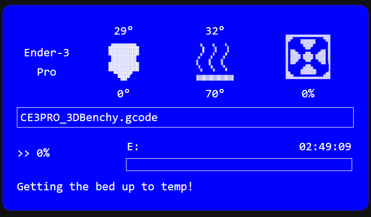

# Ender 3 Pro LCD for Home Assistant

This project replicates the LCD screen of the **Ender 3 Pro** inside a Home Assistant dashboard.  
It’s not a custom card, but a quick hack combining:

- A **Markdown card**  
- **CSS tweaks** with [card_mod](https://github.com/thomasloven/lovelace-card-mod)  
- **3 SVG images** (included in this repo)  

## Features

- Mimics the original Ender 3 Pro LCD look  
- Displays:
  - Print progress
  - Print file name (instead of X/Y/Z positions)
  - Fan percentage (via custom OctoPrint plugin → MQTT)
  - Status message (via OctoPrint [MQTT Publish](https://plugins.octoprint.org/plugins/mqtt-publish/))  
- Easy to adapt for your own sensors or entities  

## How it works

1. Install **card_mod** in your Home Assistant setup.  
2. Copy the YAML code from [`card.yaml`](./card.yaml) into your dashboard.  
3. Place the 3 SVG images in your `www/img` folder or update the paths in the code.  
4. Adjust your sensor/entity names at the top of the code.  

## Notes

- This is a quick solution, not a polished custom card.  
- Works out of the box with minor edits to match your setup.  

## Preview

---

**Hope it’s useful. Feel free to fork and improve.**
